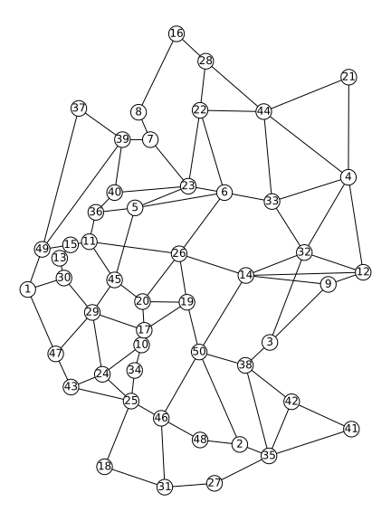
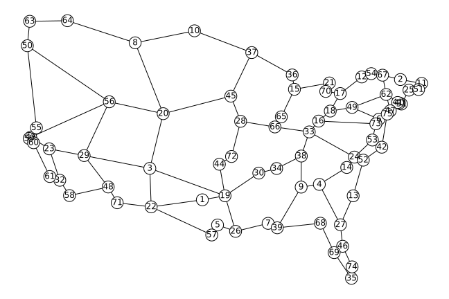

# Content Placement in 5G-enabled Edge/Core Datacenter Networks Resilient to Link Cut Attacks
Carlos Natalino, Amaro de Sousa, Lena Wosinska and Marija Furdek

**Published under open access**: https://doi.org/10.1002/net.21930

**Abstract**: High throughput, resilience, and low latency requirements drive the development of 5G-enabled content delivery networks (CDNs) which combine core data centers (cDCs) with edge data centers (eDCs) that cache the most popular content closer to the end users for traffic load and latency reduction. Deployed over the exist- ing optical network infrastructure, CDNs are vulnerable to link cut attacks aimed at disrupting the overlay services. Planning a CDN to balance the stringent service requirements and increase resilience to attacks in a cost-efficient way entails solving the content placement problem (CPP) across the cDCs and eDCs. This article pro- poses a framework for finding Pareto-optimal solutions with minimal user-to-content distance and maximal robustness to targeted link cuts, under a defined budget. We formulate two optimization problems as integer linear programming (ILP) models. The first, denoted as K-best CPP with minimal distance (K-CPP-minD), identifies the eDC/cDC placement solutions with minimal user-to-content distance. The sec- ond performs critical link set detection to evaluate the resilience of the K-CPP-minD solutions to targeted fiber cuts. Extensive simulations verify that the eDC/cDC selection obtained by our models improves network resilience to link cut attacks without adversely affecting the user-to-content distances or the core network traffic mitigation benefits.

### What's in this repo?

- The topologies files describing the topologies used in the work (`topologies` folder)

| Germany50             |  Coronet |
:-------------------------:|:-------------------------:
  |  
- The solutions of the ILP models from the paper (`data` folder)
- This jupyter notebook with the results computation and plotting

### Dependencies

We use Pandas, NetworkX and Matplotlib.

### Citing the work

Natalino C, de Sousa A, Wosinska L, Furdek  M. Content placement in 5G‐enabled edge/core datacenter networks resilient to link cut attacks. Networks, 2020, 1–13. https://doi.org/10.1002/net.21930

BibTeX entry:

```
@article{NatalinoEtAl:2020,
    author = {Carlos Natalino and Amaro de Sousa and Lena Wosinska and Marija Furdek},
    title = {Content placement in 5G‐enabled edge/core datacenter networks resilient to link cut attacks},
    journal = {Networks},
    volume = {},
    number = {},
    pages = {},
    doi = {10.1002/net.21930},
    year = {2018}
}
```
